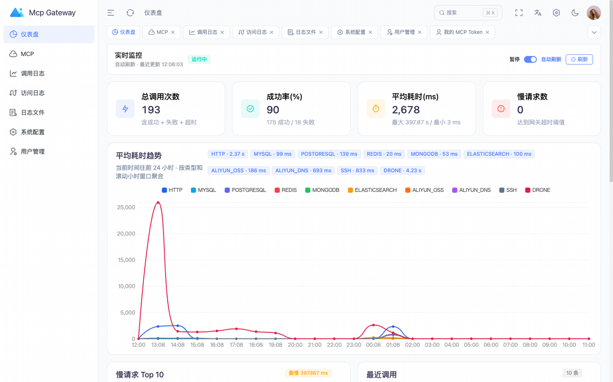
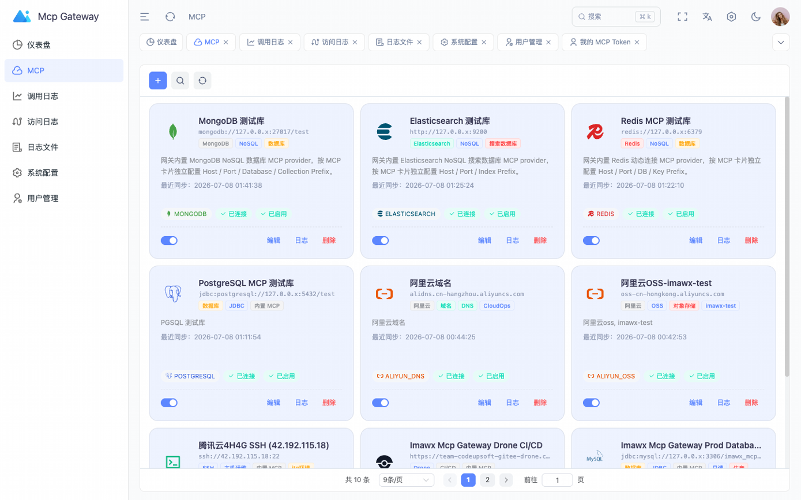
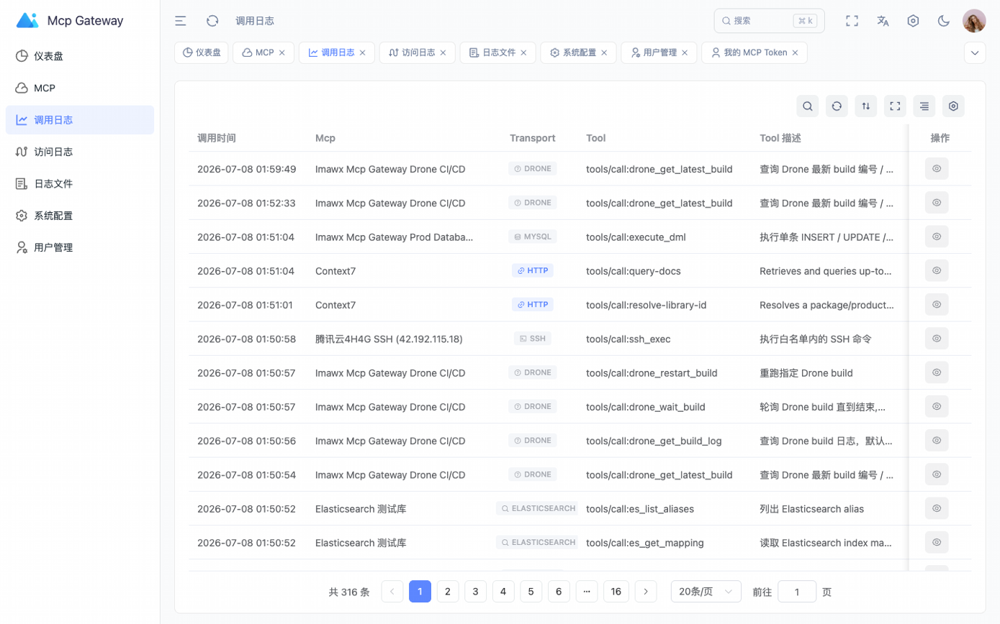

# imawx-mcp-gateway

`imawx-mcp-gateway` 是一个面向团队内部和私有化环境的 MCP 网关。它把数据库、NoSQL、云服务、SSH、CI/CD、OpenAPI/Swagger 以及外部 MCP 服务统一接入到一个标准 MCP 入口，并提供后台管理、授权、审计和监控能力。

这个项目的核心目标不是“再包一层代理”，而是让企业内部高风险能力可以被大模型安全、可控、可审计地使用。

## 功能特性

- 标准 MCP Streamable HTTP 入口：`POST /mcp`
- 外部 MCP 接入：HTTP、SSE、STDIO
- 内置 MCP Provider：MySQL、PostgreSQL、Oracle、SQL Server、Redis、MongoDB、Elasticsearch、阿里云 OSS、阿里云 DNS、SSH、Drone、Swagger API
- 多实例管理：同一类型可以接入多个实例，通过服务名、标签、描述和工具说明帮助大模型定位
- Token 授权：支持按 MCP 实例和具体 Tool 控制访问范围
- Tool 元数据重写：支持工具名称、描述、入参说明重写
- 审计日志：保存 tool 入参、结果、stream logs、调用耗时、状态、客户端信息
- 访问日志：记录 Web/API 请求来源、路径、结果和耗时
- 日志文件查看：通过 WebSocket 订阅日志文件，避免长轮询导致连接中断
- 敏感字段隐藏：调用日志和应用日志可按配置隐藏关键字段
- 安全基线：生产环境启用 HTTPS、CSRF、Session Cookie、RSA-OAEP 加密敏感数据
- MyBatis-Plus DDL 初始化：首次启动自动初始化表结构和管理员账号

## 内置 Provider 能力

| 类型 | 当前能力 |
| --- | --- |
| 关系数据库 | 表列表、表结构、表注释、查询、受控增删改，支持 MySQL / PostgreSQL / Oracle / SQL Server |
| Redis | String、Hash、List、Set、ZSet、Stream、Bitmap、HyperLogLog、Geo、SCAN、TTL、DBSIZE，支持 DB 白名单、Key Prefix 和只读模式 |
| MongoDB | Collection 列表、count、find、findOne、aggregate、distinct、索引查看、collection stats、insert、update、delete |
| Elasticsearch | Index 列表、search、count、get、mapping、alias、cluster health、index、update、delete，支持 Index Prefix |
| 阿里云 OSS | Bucket 列表、对象列表、元数据、读取文本对象、写入文本对象、复制对象、生成临时下载 URL、删除对象 |
| 阿里云 DNS | 域名列表、解析记录查询、添加/修改/删除解析记录 |
| Swagger / OpenAPI | 拉取 JSON/YAML 文档并转换为 MCP Tool，支持 Basic、Bearer、API Key Header、Method 白名单、Operation 白/黑名单和文档缓存 |
| SSH / Drone | SSH 受控命令执行；Drone 构建列表、最新构建、构建详情、日志、重跑、部署监控 |

## 页面预览

截图来自实际生产环境，已对公网 IP、Trace、User-Agent 等敏感信息做脱敏处理。

### 仪表盘



### MCP 实例管理



### 调用日志审计



## 架构概览

```text
MCP Client / 大模型
        |
        | POST /mcp
        v
imawx-mcp-gateway
        |
        |-- 认证：Bearer Token / Web Session
        |-- 授权：MCP 实例范围 + Tool 范围
        |-- 路由：外部 MCP / 内置 Provider
        |-- 审计：mcp_call_log / mcp_access_log
        |
        +--> 外部 MCP Server（HTTP / SSE / STDIO）
        +--> 数据库（MySQL / PostgreSQL / Oracle / SQL Server）
        +--> NoSQL（Redis / MongoDB / Elasticsearch）
        +--> 云服务（阿里云 OSS / DNS）
        +--> 运维系统（SSH / Drone / Swagger API）
```

更多细节见 [架构说明](docs/ARCHITECTURE.md)。

## 技术栈

后端：

- Java 25
- Spring Boot 4.1
- Spring AI MCP Client 2.0
- MyBatis-Plus 3.5
- MySQL 8
- Spring Session JDBC

前端：

- Vue 3
- TypeScript
- Vite
- Element Plus
- Pinia
- ECharts

## 快速启动

环境要求：

- JDK 25
- Maven 3.9+
- Node.js 22+
- pnpm 9+
- MySQL 8

创建数据库：

```sql
CREATE DATABASE imawx_mcp_gateway
  DEFAULT CHARACTER SET utf8mb4
  DEFAULT COLLATE utf8mb4_unicode_ci;
```

启动后端：

```bash
export SPRING_PROFILES_ACTIVE=dev
export MCP_GATEWAY_DATABASE_HOST=127.0.0.1:3306
export MCP_GATEWAY_DATABASE_USERNAME=mcp_gateway
export MCP_GATEWAY_DATABASE_PASSWORD=mcp_gateway

cd mcp-gateway
mvn spring-boot:run
```

启动前端：

```bash
cd mcp-web-ui
pnpm install
pnpm dev
```

首次启动后，系统会初始化管理员账号，并把一次性的初始密码和 TOTP 信息写入日志目录下的 bootstrap 文件。完成首次登录和改密后，请删除该文件。

## 本地私有配置

仓库只提交示例配置，不提交真实开发或生产配置。

开发环境：

```bash
cp mcp-gateway/src/main/resources/application-localdev.example.yml \
   mcp-gateway/src/main/resources/application-localdev.yml

SPRING_PROFILES_ACTIVE=dev,localdev mvn spring-boot:run
```

生产私有覆盖：

```bash
cp mcp-gateway/src/main/resources/application-localprod.example.yml \
   mcp-gateway/src/main/resources/application-localprod.yml

java -jar mcp-gateway.jar --spring.profiles.active=prod,localprod
```

`application-localdev.yml`、`application-localprod.yml` 和 `application-*.local.yml` 已加入 `.gitignore`。

## 生产部署

推荐单机目录：

```text
/app/imawx-mcp-gateway/
├── app/
│   ├── mcp-gateway.jar
│   └── logs/
└── dist/
    └── index.html
```

Nginx 推荐同域部署：

- `/`：前端 SPA
- `/api/`：后台管理 API
- `/mcp`：标准 MCP 入口
- `/ws/`：日志 WebSocket

完整部署步骤见 [部署文档](docs/DEPLOYMENT.md)。

## 安全提醒

MCP 网关一旦接入数据库、云资产、SSH 或 CI/CD，就属于高权限基础设施。上线前至少确认：

- 生产环境强制 HTTPS
- 生产环境启用 CSRF
- Session Cookie 使用 `HttpOnly`、`Secure`、`SameSite`
- 每个 MCP 实例使用最小权限账号
- API Token 只授权必要的 MCP 实例和 Tool
- 数据库、OSS、DNS、SSH、Drone 等实例配置资源范围
- 调用日志和应用日志启用敏感字段隐藏
- `/ws/**` 日志订阅必须要求登录态

完整清单见 [安全说明](docs/SECURITY.md)。

## 内置 Provider 扩展

内置 MCP 通过 Provider 模式扩展。新增能力时建议：

1. 在 `service/mcpproxy/provider/...` 下创建清晰的 provider 包。
2. 实现统一的 Provider 接口。
3. 使用 `@McpToolDefinition` 注解声明 Tool 元数据。
4. 在 `resources/mcp/*.json` 中补充创建模板、探活工具和校验规则。
5. 把普通配置写入 `mcp_backend_extension.config_json`。
6. 把密钥写入 `mcp_backend_extension.secret_enc`。

详细说明见 [扩展内置 Provider](docs/EXTENDING_PROVIDERS.md)。

## 文档

- [架构说明](docs/ARCHITECTURE.md)
- [部署文档](docs/DEPLOYMENT.md)
- [安全说明](docs/SECURITY.md)
- [扩展内置 Provider](docs/EXTENDING_PROVIDERS.md)
- [代码规范](docs/CODE_STYLE.md)
- [贡献指南](CONTRIBUTING.md)

## 许可证

本项目使用 MIT License，详见 [LICENSE](LICENSE)。

前端基于 Art Design Pro 源码基座改造，二次分发时请保留上游项目声明。
