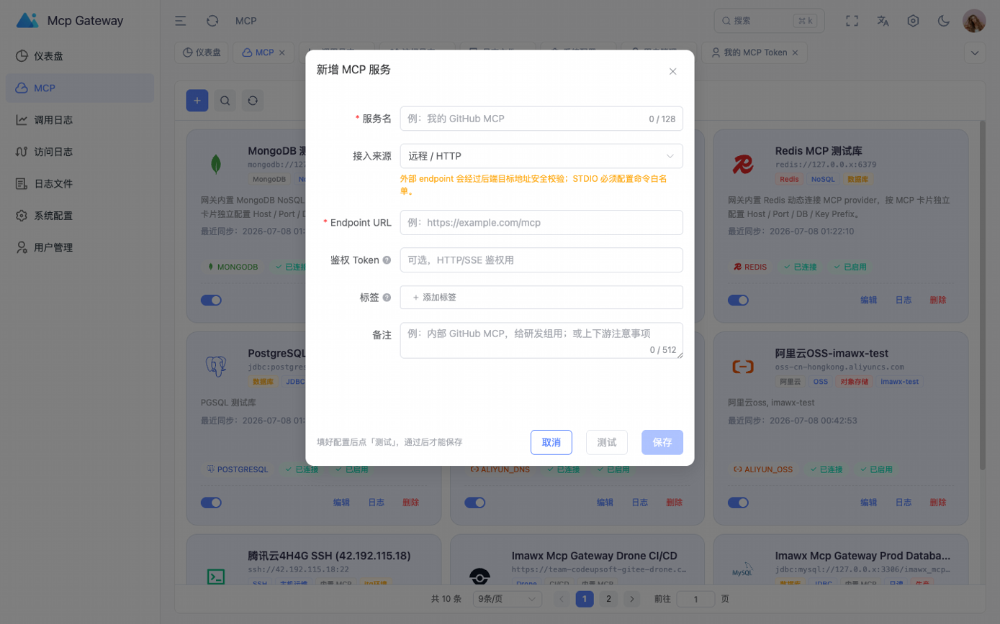
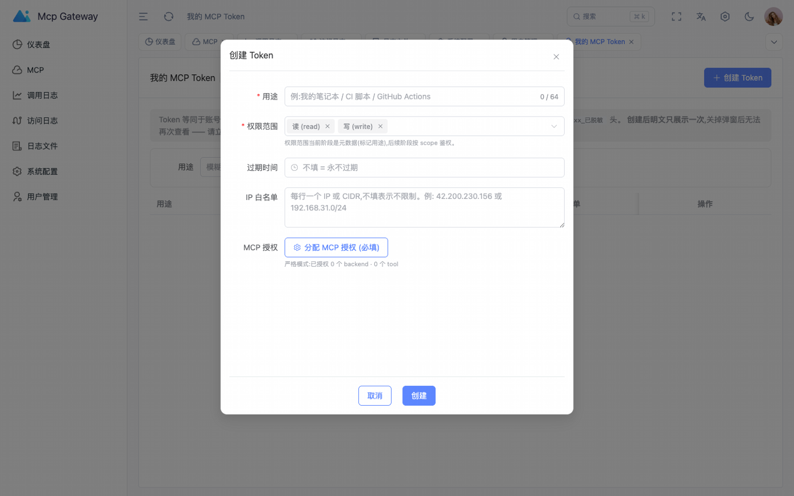
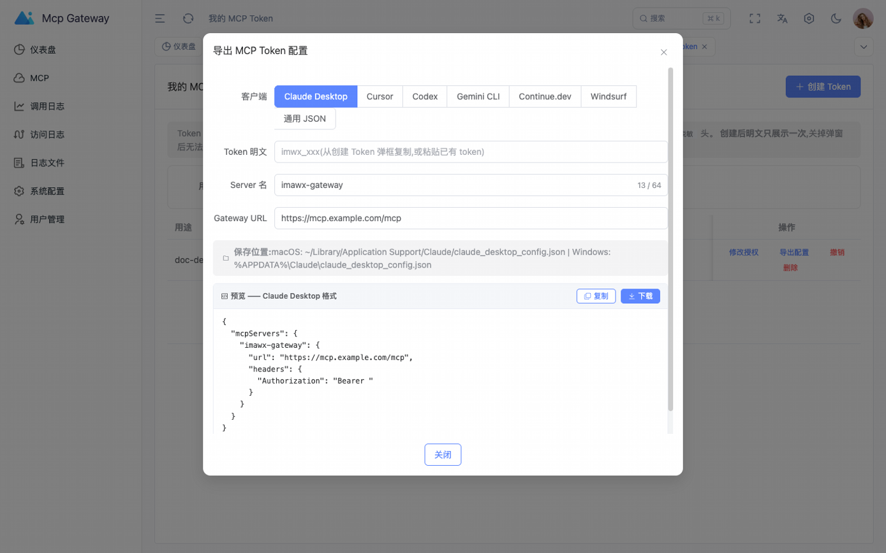
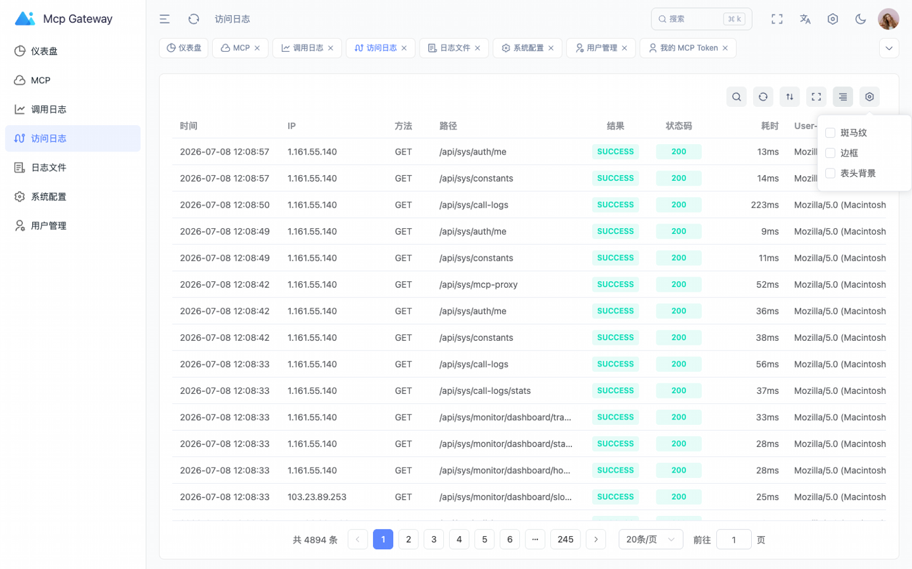
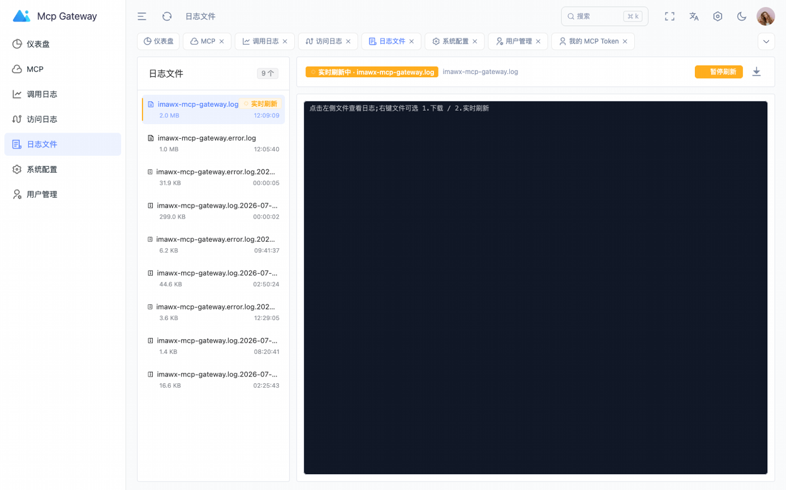
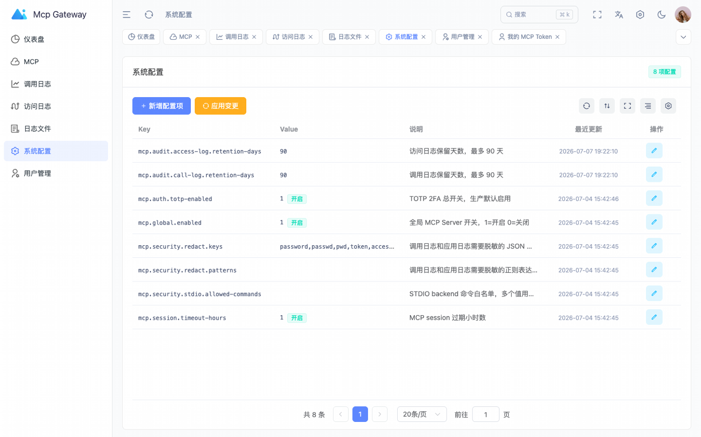
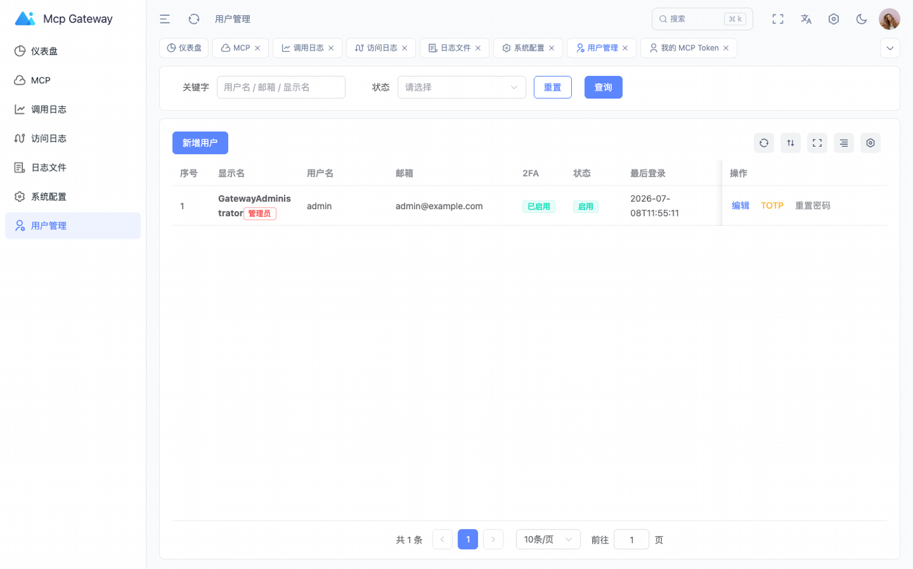
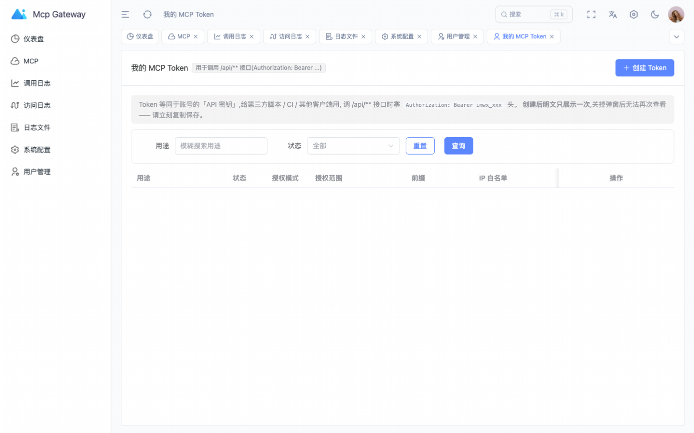
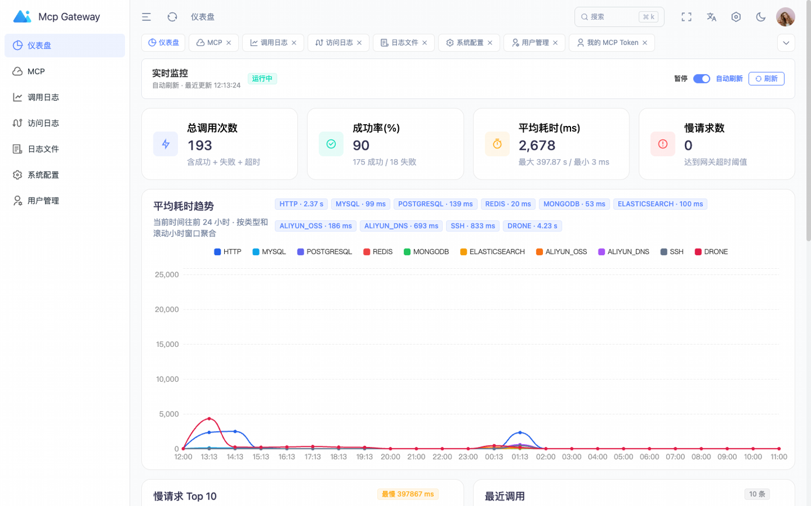

# imawx-mcp-gateway 产品介绍

> 把企业内部的高风险能力（数据库、NoSQL、云服务、SSH、CI/CD、内部 API、外部 MCP）统一封装成一个标准 MCP 入口，让 AI **可控、可审计、可降权**地使用它们。

- 部署形态：私有化 / 单机，可作为团队 AI Agent 的统一工具网关
- 协议：标准 MCP Streamable HTTP（`POST /mcp`），兼容所有遵循 MCP 规范的客户端（Claude、Cursor、Continue、Codex、Gemini CLI、自研 Agent）

---

## 1. 这产品解决什么问题

把数据库密码、OSS AccessKey、SSH 私钥交给大模型 Agent 直接调用，任何一家成熟公司的安全团队都不会同意。问题是：

- **没网关前**，团队每个 Agent 都得自己写 wrapper / 自己接数据库 —— N 份重复代码 + N 份独立审计盲区
- **自建 wrapper 几乎都没有授权粒度** —— 一人离职 = 整套凭据在公司账户体系外流转
- **LLM 直接拼 SQL 没有 schema 限制 + 调用审计** —— 出了事复盘都没数据

`imawx-mcp-gateway` 就是把这些"风险前置"的能力收敛到一个网关：

| 维度 | 没网关之前 | 接入网关之后 |
| --- | --- | --- |
| 凭据管理 | 每个 Agent 各存一份 | 网关集中存放 + 加密 + 可轮换 |
| 授权粒度 | 谁能连数据库 = DBA 团队说了算，零审计 | 每个 Token 限定 MCP 实例 + Tool 子集 |
| SQL / 命令 | LLM 自己拼接 | Provider 层做 schema / table / namespace 白名单 |
| 审计 | 没有 / 各 Agent 各写一套 | 调用日志 + 访问日志全量入库 |
| 接入新能力 | 团队再 fork 一个 wrapper | 后台点 `+`，填参，启用 |

**一句话：让 AI 真的好用，但出事有兜底。**

---

## 2. 核心能力速览

- **标准 MCP 入口**：`POST /mcp` 接 Streamable HTTP，所有遵循 MCP 协议的客户端即插即用
- **12 类内置 Provider**：见第 5 节详细清单（DB×4 / Redis / MongoDB / Elasticsearch / 阿里云 OSS / 阿里云 DNS / SSH / Drone / Swagger / OpenAPI）
- **外部 MCP 接入**：HTTP / SSE / STDIO 三种 transport
- **多实例管理**：同一类型可挂多份（如多份 MySQL），通过服务名 / 标签 / 描述帮大模型定位
- **细粒度授权**：API Token 单独绑定 "允许的 MCP 实例" + "允许的 Tool 子集"
- **Tool 元数据重写**：可改工具名、描述、参数说明，让大模型选得更准
- **完整审计**：调用入参 + 返回 + 流式日志 + 耗时 + 状态 + 客户端指纹
- **Dashboard**：24h 趋势 + 慢请求 Top 10 + 最近调用 Top 10，可暂停可手动刷新
- **敏感字段隐藏**：调用日志 + 应用日志可按配置隐藏关键字段
- **生产级安全基线**：HTTPS / CSRF / HttpOnly + Secure + SameSite Session Cookie / RSA-OAEP 加密密钥 / 强制 2FA
- **首启零配置**：MyBatis-Plus 自动建表 + 自动初始化管理员（密码 + TOTP 一次性写入受控文件）

---

## 3. 后台 8 大功能模块

后台一共 8 个一级菜单，全部基于 Vue 3 + Element Plus + ECharts。

### 3.1 仪表盘

聚合视角：4 张统计卡 + 平均耗时趋势折线（按类型分） + 慢请求 Top 10 + 最近调用 Top 10。可手动刷新 / 暂停自动刷新。


### 3.2 MCP 服务管理

卡片网格展示所有注册的 MCP 服务。每个卡片显示服务名 / endpoint / transport / 状态 / 操作按钮。toolbar 只有 3 个实心按钮：新增 / 搜索 / 刷新。


### 3.3 新增 MCP 服务

弹窗表单：服务名 / endpoint / transport 类型。**外部 endpoint 走后端目标地址安全校验**，**STDIO 必须配置命令白名单**。



### 3.4 创建 MCP Token

右上角头像 → **我的 MCP Token** → **`创建 Token`**。



Token 表单字段：

| 字段 | 必填 | 说明 |
| --- | :---: | --- |
| 用途 | ✅ | 备注名（最长 64 字符），用来区分调用方 |
| 权限范围 | ✅ | `read` / `write` 元数据标记，当前阶段不做 RBAC 鉴权 |
| 过期时间 |  | 不填 = 永不过期 |
| IP 白名单 |  | 每行一个 IP 或 CIDR，不填 = 不限制 |
| MCP 授权 | ✅ | 见下方授权模式说明 |

**授权模式（核心安全开关）**：

- **全开放**（`restrictMode=0`）：Token 默认可调任何 backend + tool，不再写授权表。适合个人笔记本 / 开发调试。
- **严格**（`restrictMode=1`，默认）：必须勾选 `backend` 或 `tool` 之一才会生效；两个白名单是 **OR** 关系，任一命中即通过。建议所有生产 Token 都用这个模式。

提交后弹窗只展示一次**明文 token**，**关掉弹窗后无法再次查看**——立即复制到密码管理器。

### 3.5 导出 MCP Token 接入配置

每个有效 Token 都支持一键导出标准客户端配置，覆盖 6 种官方客户端 + 通用 JSON：

| 客户端 | 说明 |
| --- | --- |
| Claude Desktop | `~/Library/Application Support/Claude/claude_desktop_config.json` |
| Cursor | `.cursor/mcp.json` |
| Codex | OpenAI 风格 MCP 配置 |
| Gemini CLI | Google 风格 MCP 配置 |
| Continue.dev | VS Code / JetBrains Continue |
| Windsurf | Codeium IDE MCP 配置 |
| 通用 JSON | 任何其他 MCP 客户端通用格式 |



### 3.6 调用日志

按 MCP 实例 / 客户端 / 时间筛选；每条日志可展开看完整入参 + 返回 + 流式输出 + 耗时 + 状态码。


### 3.7 访问日志

Web / API 层的请求访问日志，记录来源 IP / 路径 / 返回码 / 耗时，用于排查"谁调过什么"。这是网络层日志，跟调用日志（业务调用记录）是两层不同的事。



### 3.8 日志文件

通过 **WebSocket** 实时 tail 应用日志文件（**不再长轮询**），按文件名白名单限定可查范围，**必须登录态**才能订阅。



### 3.9 系统配置

TOTP 总开关 / 敏感字段隐藏规则 / IP 白名单等 **runtime 配置**。改了"应用变更"即生效，**不需要重启后端**。



### 3.10 用户管理

Admin 在 R_SUPER 角色下管理后台账号（CRUD / TOTP 重置 / 启停 / 重置密码）。



### 3.11 我的 MCP Token（个人视角）

跟 3.4 / 3.5 是同一页面，用户视角下看到的是自己创建的全部 Token。



---

## 4. 完整使用流程

下面演示一条端到端流程：登录 → 新增 MCP → 颁发 Token → 接入 LLM → 调用 → 审计。

### Step 1 · 登录后台

浏览器打开 `/login`，输入邮箱 + 密码 + TOTP 验证码。全局 2FA 默认开启，**首次部署的初始密码 + TOTP 密钥会由 AdminBootstrapper 写入 logs/ 下的一次性 bootstrap 文件，读完请删除**。



### Step 2 · 进 Dashboard 看一眼

登录后默认跳到仪表盘。先确认调用没阻塞、Token 没异常，再做后续操作。


### Step 3 · 注册一个新 MCP（以 MySQL 为例）

点 **MCP** → 卡片网格 toolbar 上的 `+` 按钮：


填表（示例：自有 MySQL 实例）：

| 字段 | 示例 |
| --- | --- |
| 服务名 | `orders-mysql` |
| 描述 | "订单库，只读" |
| Transport | `MYSQL` |
| Endpoint | `jdbc:mysql://10.x.x.x:3306/orders` |
| Config (JSON) | `{"username":"readonly","schemaWhitelist":["orders"],"readOnly":true}` |
| 密钥 | 由网关 RSA-OAEP 公钥加密后入库 |

> **Endpoint 安全校验**：
>
> - 外部 MySQL / Oracle / SQL Server / PostgreSQL：后端校验 `endpoint` 是合法 JDBC URL，且账号必须能在 `schemaWhitelist` 内操作
> - STDIO：必须配置 `command` 白名单和 `args` 模式
> - HTTP / SSE：必须 `https://` 开头的 endpoint，且不能在网关同域

确认。卡片立刻出现在列表，dashboard 上 24h 趋势图也会开始累加数据。

### Step 4 · 颁发 Token 接入大模型

右上角头像 → **我的 MCP Token** → **创建 Token**：


这一步关键在于**严格 + 最小授权**：

- 选"严格"模式
- 分配 MCP 授权里 **只勾你想让这个 Agent 能调的 backend**（例：只勾 `orders-mysql`）
- **甚至精确到 backend 的 tool 子集**（例：只勾 `query_select` / `list_tables` / `describe_table`）
- 启用 IP 白名单：只允许来自你 Anolis / K8s 内部 IP 段
- 选个过期时间：30 天或更短，定期轮换

> **生产建议**：一个 Agent = 一个 Token；每个 Token 限定到一个 MCP 实例和一个 tool 子集；Token 名字里写清楚"哪个 Agent 哪个用途"（例：`prod-orders-agent-readonly`）。

提交后弹窗只展示一次明文。

### Step 5 · 导出客户端配置

点列表行里的 **导出配置**，拿到一份可以直接导入的 mcp.json：


通用 JSON 片段（脱敏版）：

```json
{
  "mcpServers": {
    "imawx-gateway": {
      "url": "https://mcp.example.com/mcp",
      "headers": {
        "Authorization": "Bearer imwx_xxxxx_已脱敏"
      }
    }
  }
}
```

> ⚠️ **请用导出弹窗里的原文**，不要把 `imwx_xxxxx_已脱敏` 字面写到配置里 —— 那是占位符。

导入方式：

- Claude Desktop → 写入 `~/Library/Application Support/Claude/claude_desktop_config.json`
- Cursor → Settings → MCP → Add new global MCP server
- Continue.dev → `~/.continue/config.json`
- 自研 Agent → MCP Client SDK 添加 Server

### Step 6 · 在 Agent 里调用一次验证

以 curl 直接打 `/mcp` 为例（用你的真实 token 替换）：

```bash
curl -sS https://mcp.example.com/mcp \
  -H "Authorization: Bearer <你的 Token>" \
  -H "Content-Type: application/json" \
  -H "Accept: application/json, text/event-stream" \
  -d '{
    "jsonrpc": "2.0",
    "id": 1,
    "method": "tools/list",
    "params": {}
  }'
```

成功会返回 `{result:{tools:[...]}}`，列出该 Token 被授权的全部 tool。如果 Token 无效 / 过期 / 没权限，返回 `40100 token 无效、过期或已撤销` 或 `40300 token 越权`。

### Step 7 · 在后台看调用

到 **调用日志** 页，按时间倒序找刚才那条调用，可展开看入参 + 返回 + 流式输出 + 耗时。


---

## 5. 内置 Provider 工具全清单

### 5.1 关系数据库（MySQL / PostgreSQL / Oracle / SQL Server）

4 类关系数据库共用同一套 tool schema，由 `RelationalDbMcpProviderSupport` 统一实现：

| Tool | 类型 | 说明 |
| --- | --- | --- |
| `list_tables` | read | 列出 schema 下所有表，可按 schema / 关键字过滤 |
| `describe_table` | read | 看表结构 + 字段注释 + 主键 |
| `query_select` | read | 执行 `SELECT` 语句（只读账号最常用） |
| `insert_row` | write | 插入一行（需非只读） |
| `update_rows` | write | 按条件更新（需非只读，可加 row 数量上限） |
| `delete_rows` | write | 按条件删除（需非只读，可加 row 数量上限） |

**配置示例（MySQL）**：

```jsonc
{
  "username": "readonly",
  "password": "...",
  "schemaWhitelist": ["orders", "inventory"],   // 只允许访问这俩 schema
  "readOnly": true,                              // 禁用 insert/update/delete
  "rowLimit": 1000                               // 单查询最多 1000 行
}
```

### 5.2 Redis

覆盖 String / Hash / List / Set / ZSet / Stream / Bitmap / HyperLogLog / Geo / SCAN / TTL / DBSIZE 全场景，约 50 个 tool：

| 数据类型 | Tool |
| --- | --- |
| Key 通用 | `redis_type`、`redis_ttl`、`redis_expire`、`redis_exists`、`redis_delete`、`redis_scan`、`redis_dbsize` |
| String | `redis_get`、`redis_set`、`redis_incr`、`redis_mget`、`redis_mset` |
| Hash | `redis_hget`、`redis_hset`、`redis_hgetall`、`redis_hdel` |
| List | `redis_lrange`、`redis_llen`、`redis_lpush`、`redis_rpush`、`redis_lpop`、`redis_rpop` |
| Set | `redis_smembers`、`redis_sismember`、`redis_sadd`、`redis_srem` |
| ZSet | `redis_zrange`、`redis_zadd`、`redis_zrem` |
| Stream | `redis_xadd`、`redis_xrange` |
| Bitmap | `redis_setbit`、`redis_getbit`、`redis_bitcount` |
| HyperLogLog | `redis_pfadd`、`redis_pfcount` |
| Geo | `redis_geoadd`、`redis_geodist`、`redis_georadius` |

**配置示例**：

```jsonc
{
  "host": "10.x.x.x",
  "port": 6379,
  "password": "...",
  "dbWhitelist": [0, 1, 2],     // 只允许 DB 0/1/2
  "keyPrefix": "app:cache:",     // 所有 key 必须以这个 prefix 开头
  "readOnly": true               // 禁用写
}
```

### 5.3 MongoDB

| Tool | 说明 |
| --- | --- |
| `mongo_list_collections` | 列出 collection |
| `mongo_collection_stats` | collection 统计（size / count / storageSize） |
| `mongo_count` | 条件计数 |
| `mongo_find` | 查询（支持 projection / sort / limit / skip） |
| `mongo_find_one` | 单文档查询 |
| `mongo_aggregate` | 聚合管道 |
| `mongo_distinct` | distinct |
| `mongo_list_indexes` | 查看索引 |
| `mongo_insert_one` | 插入单文档 |
| `mongo_update_many` | 条件更新（支持 `$set` / `$inc` / `$push` 等） |
| `mongo_delete_many` | 条件删除 |

**配置示例**：

```jsonc
{
  "host": "10.x.x.x",
  "port": 27017,
  "database": "orders",
  "username": "readonly",
  "password": "...",
  "authSource": "admin",
  "collectionPrefix": "ord_"     // 限定 collection 前缀
}
```

### 5.4 Elasticsearch

| Tool | 说明 |
| --- | --- |
| `es_list_indices` | 列出 index |
| `es_list_aliases` | 列出 alias |
| `es_get_mapping` | index mapping |
| `es_cluster_health` | 集群健康 |
| `es_count` | 计数 |
| `es_search` | DSL 查询 |
| `es_get_doc` | 按 id 取文档 |
| `es_index_doc` | 索引文档（upsert） |
| `es_update_doc` | 按 query 更新 |
| `es_delete_doc` | 按 query 删除 |

**配置示例**：

```jsonc
{
  "host": "10.x.x.x",
  "port": 9200,
  "scheme": "http",
  "username": "...",
  "password": "...",
  "indexPrefix": "logs-"          // 只允许读 logs-* index
}
```

### 5.5 阿里云 OSS

| Tool | 说明 |
| --- | --- |
| `oss_list_buckets` | 列出当前账号下所有 bucket |
| `oss_list_objects` | 列出某 bucket 下对象（prefix 过滤） |
| `oss_get_object_metadata` | 取对象元信息（大小 / type / etag） |
| `oss_get_object_text` | 取文本对象（≤ 1MB 推荐） |
| `oss_put_object_text` | 上传文本对象 |
| `oss_put_object_file` | 上传二进制对象 |
| `oss_copy_object` | 跨 bucket / 同 bucket 复制 |
| `oss_presign_get_object` | 生成临时下载 URL（可设过期秒） |
| `oss_delete_object` | 删除对象 |

**配置示例**：

```jsonc
{
  "accessKeyId": "...",
  "accessKeySecret": "...",
  "endpoint": "oss-cn-hangzhou.aliyuncs.com",
  "bucketWhitelist": ["my-pub-bucket"],
  "prefixWhitelist": ["docs/"]    // 限定路径前缀
}
```

### 5.6 阿里云 DNS

| Tool | 说明 |
| --- | --- |
| `dns_list_domains` | 列出当前账号下的所有域名 |
| `dns_list_records` | 查某域名的解析记录（按 type / value 过滤） |
| `dns_upsert_record` | 添加 / 修改解析记录 |
| `dns_delete_record` | 删除解析记录 |

**配置示例**：

```jsonc
{
  "accessKeyId": "...",
  "accessKeySecret": "...",
  "regionId": "cn-hangzhou",
  "domainWhitelist": ["example.com"]
}
```

### 5.7 SSH

| Tool | 说明 |
| --- | --- |
| `ssh_probe` | 探活（验证端口 / 凭据） |
| `ssh_exec` | 在白名单范围内执行命令 |
| `ssh_allowed_commands` | 查看当前 MCP 实例配置的命令白名单 |

**配置示例**（这是最危险的一类，必须严格控制）：

```jsonc
{
  "host": "10.x.x.x",
  "port": 22,
  "username": "deploy",
  "authType": "password",
  "password": "...",
  "commandWhitelist": [
    "systemctl status *",
    "journalctl -u * --since 24h ago",
    "df -h",
    "free -m",
    "docker ps",
    "kubectl get pods"
  ],
  "denyPatterns": [".*rm.*", ".*mkfs.*", ".*shutdown.*"]
}
```

### 5.8 Drone CI

| Tool | 说明 |
| --- | --- |
| `drone_get_repo` | 查仓库基本信息 |
| `drone_list_builds` | 列出 build 历史 |
| `drone_get_latest_build` | 最新一次 build |
| `drone_get_build_status` | 实时 build 状态 |
| `drone_wait_build` | 阻塞等 build 完成 |
| `drone_restart_build` | 重跑 build |
| `drone_get_build_log` | 取构建日志 |

**配置示例**：

```jsonc
{
  "serverUrl": "https://drone.example.com",
  "personalAccessToken": "...",
  "repoWhitelist": ["myorg/myapp"]
}
```

### 5.9 Swagger / OpenAPI

工具**由文档动态生成**，不在固定清单内：

1. 网关读到 `swagger.json` / `swagger.yaml`
2. 按 `operationId` / `path + method` 映射成 MCP tool 名
3. 自动转 `path parameters` / `query` / `body` 为 JSON Schema
4. 支持 Basic / Bearer / API Key Header 三种认证代理
5. 支持 Method 白名单、Operation 黑/白名单、文档缓存

**配置示例**：

```jsonc
{
  "docsUrl": "https://api.example.com/v3/api-docs",
  "basicUsername": "...",
  "basicPassword": "...",
  "methodAllowlist": ["GET"],       // 只暴露读操作
  "operationAllowlist": ["pet.*"]    // 只暴露 pet 命名空间下的
}
```

### 5.10 外部 MCP（HTTP / SSE / STDIO）

| Transport | 用途 | Endpoint 校验 |
| --- | --- | --- |
| `HTTP` | 调用外部 HTTP MCP 端点 | 必须 `https://`，不能在网关同域 |
| `SSE` | 调用外部 SSE MCP 端点 | 同 HTTP |
| `STDIO` | 启动本地命令 | 必须配置 `command` 白名单 + `args` 模式 |

外部 MCP 注册后会被纳入统一的授权 / 审计体系，跟内置 Provider 行为一致。

---

## 6. 安全设计（高风险基础设施的安全底线）

`imawx-mcp-gateway` 一旦接入数据库 / 云资产 / SSH / CI/CD，就是高权限基础设施。本节是设计哲学层；完整 checklist 见 [docs/SECURITY.md](docs/SECURITY.md)。

### 6.1 双认证域

系统有两套独立的认证，**鉴权路径完全分离**：

- **Web 后台**（Session Cookie + HttpOnly + Secure + SameSite）
  - 给人用，浏览器登录后台管理
- **第三方客户端 API**（API Token / Bearer）
  - 给 Agent / 大模型用，HTTP Header 鉴权
  - Token 与用户绑定：admin 禁用账号 → Token **立刻失效**

两套凭证**不互通**：管理员后台账号密码不能用来调 MCP，反之亦然。

### 6.2 双层开关（总开关 × 用户开关）

任何安全特性（TOTP、敏感字段隐藏、命令白名单等）都是两层开关叠加：

```
启用 = 全局配置(config 表) == 启用  AND  用户 / 实例级配置 == 启用
```

这样既能在 dev 关掉方便调试，又能在 prod 强制默认开，不会因为单一配置漂移导致整体失防。

### 6.3 密钥加密

- 数据库密码 / OSS AccessKey / SSH 私钥等一旦入库就走 **RSA-OAEP** 公钥加密
- 私钥通过 `MCP_GATEWAY_SECURITY_TOTP_KEY_FILE` 或外部 KMS 提供，应用启动时加载
- 密钥**永不进日志、永不进调用日志**
- Token 本身在 DB 也只存哈希，明文只展示一次

### 6.4 调用审计

每次 MCP 调用入 `mcp_call_log`：

- 调用方 IP / User-Agent
- MCP 实例 ID / Tool 名
- 完整入参 + 返回（敏感字段按配置过滤）
- 流式日志
- 耗时 / 状态

Web / API 层访问记录入 `mcp_access_log`。日志文件查看**必须 WebSocket 鉴权 + 文件名白名单**。

### 6.5 最小权限模板

内置 Provider 的配置字段天然支持白名单 / 范围限定：

| Provider | 白名单字段 |
| --- | --- |
| MySQL / Postgres / Oracle / SQL Server | `schemaWhitelist`、`readOnly`、`rowLimit` |
| Redis | `dbWhitelist`、`keyPrefix`、`readOnly` |
| MongoDB | `database`、`collectionPrefix` |
| Elasticsearch | `indexPrefix` |
| 阿里云 OSS | `bucketWhitelist`、`prefixWhitelist` |
| 阿里云 DNS | `domainWhitelist` |
| SSH | `commandWhitelist`、`denyPatterns` |
| Drone | `repoWhitelist` |
| Swagger | `methodAllowlist`、`operationAllowlist` |

实战原则：**一个能力 / 一个实例 / 一个最小权限账号**，不要把生产 root 全都接进来。

---

## 7. 架构

```text
                            ┌──────────────────────────┐
MCP Client / 大模型 ──HTTP──▶  imawx-mcp-gateway        │
                            │  (Spring Boot 4.1)        │
                            │                          │
                            │  ┌─ 认证 ──────────┐     │
                            │  │ Bearer Token    │     │
                            │  │ Session Cookie  │     │
                            │  └─────────────────┘     │
                            │  ┌─ 授权 ──────────┐     │
                            │  │ MCP 实例范围     │     │
                            │  │ Tool 范围        │     │
                            │  └─────────────────┘     │
                            │  ┌─ 路由 ──────────┐     │
                            │  │ 外部 MCP / Provider│   │
                            │  └─────────────────┘     │
                            │  ┌─ 审计 ──────────┐     │
                            │  │ mcp_call_log     │     │
                            │  │ mcp_access_log   │     │
                            │  └─────────────────┘     │
                            └────────┬─────────────────┘
                                     │
       ┌──────────────────┬──────────┼──────────┬────────────────────┐
       │                  │          │          │                    │
       ▼                  ▼          ▼          ▼                    ▼
外部 MCP Server     关系数据库      NoSQL       云服务                  运维
HTTP / SSE / STDIO  MySQL          Redis       阿里云 OSS / DNS       SSH / Drone
                   PostgreSQL      MongoDB
                   Oracle          Elasticsearch
                   SQL Server
                   Swagger / OpenAPI
```

更详细的架构 / 模块拆分见 [docs/ARCHITECTURE.md](docs/ARCHITECTURE.md)。

---

## 8. 部署速览

> 完整步骤见 [docs/DEPLOYMENT.md](docs/DEPLOYMENT.md)。下面是单机最小拓扑。

```text
/app/imawx-mcp-gateway/
├── app/
│   ├── mcp-gateway.jar
│   └── logs/
└── dist/
    └── index.html
```

Nginx 同域转发：

| 路径 | 后端 |
| --- | --- |
| `/` | 前端 SPA 静态文件 |
| `/api/` | 后台管理 API（Session Cookie 鉴权） |
| `/mcp` | 标准 MCP Streamable HTTP 入口（Bearer Token 鉴权） |
| `/ws/` | 日志 WebSocket（Session 鉴权） |

最小环境：

- JDK 25
- Maven 3.9+
- Node.js 22+ / pnpm 9+
- MySQL 8

创建数据库：

```sql
CREATE DATABASE imawx_mcp_gateway
  DEFAULT CHARACTER SET utf8mb4
  DEFAULT COLLATE utf8mb4_unicode_ci;
```

启动后端：

```bash
export SPRING_PROFILES_ACTIVE=dev
export MCP_GATEWAY_DATABASE_HOST=127.0.0.1:3306
export MCP_GATEWAY_DATABASE_USERNAME=mcp_gateway
export MCP_GATEWAY_DATABASE_PASSWORD=mcp_gateway

cd mcp-gateway
mvn spring-boot:run
```

启动前端：

```bash
cd mcp-web-ui
pnpm install
pnpm dev
```

首次启动后系统会写一个 bootstrap 文件到 logs/，里头是初始 admin 密码 + TOTP secret + otpauth URI。**读完请删除**。

---

## 9. 技术栈

**后端**

- Java 25
- Spring Boot 4.1
- Spring AI MCP Client 2.0
- MyBatis-Plus 3.5（DDL 自动初始化）
- MySQL 8
- Spring Session JDBC

**前端**

- Vue 3 + TypeScript + Vite
- Element Plus
- Pinia
- ECharts

**安全 / 协议**

- 标准 MCP Streamable HTTP
- Spring Security 6（CSRF / Session Cookie）
- RSA-OAEP 加密（AES 对称 key → RSA PEM 私钥，2026-07-04 重构）
- TOTP 2FA（RFC 6238）

---

## 10. 配套文档

| 文档 | 内容 |
| --- | --- |
| [README.md](README.md) | 项目总览 / 内置 Provider 一览 / 快速启动 |
| [docs/ARCHITECTURE.md](docs/ARCHITECTURE.md) | 模块拆分 / 请求生命周期 / Provider 接口契约 |
| [docs/DEPLOYMENT.md](docs/DEPLOYMENT.md) | 生产部署 / Nginx / systemd / HTTPS |
| [docs/SECURITY.md](docs/SECURITY.md) | 安全 checklist / 密钥处理 / Provider 安全建议 |
| [docs/EXTENDING_PROVIDERS.md](docs/EXTENDING_PROVIDERS.md) | 新增内置 Provider 的步骤与注解 |
| [docs/CODE_STYLE.md](docs/CODE_STYLE.md) | 代码规范 |
| [CONTRIBUTING.md](CONTRIBUTING.md) | 贡献指南 |

---

## 11. 我们不解决的问题（边界）

写明边界，避免误用：

- **不**是大模型 / Agent 运行时 —— 只做工具网关
- **不**做多租户隔离 —— 单团队内部使用，多团队请各自部署
- **不**做 Serverless / 弹性 —— 单机目录部署是当前主线设计
- **不**做 RBAC 复杂权限模型 —— 当前是 admin / 普通用户 二级模型
- **不**替代专业 APM —— 仅做调用日志 + 简单趋势分析

---

## 12. License

MIT。前端基于 Art Design Pro 源码基座改造，二次分发时请保留上游项目声明。
